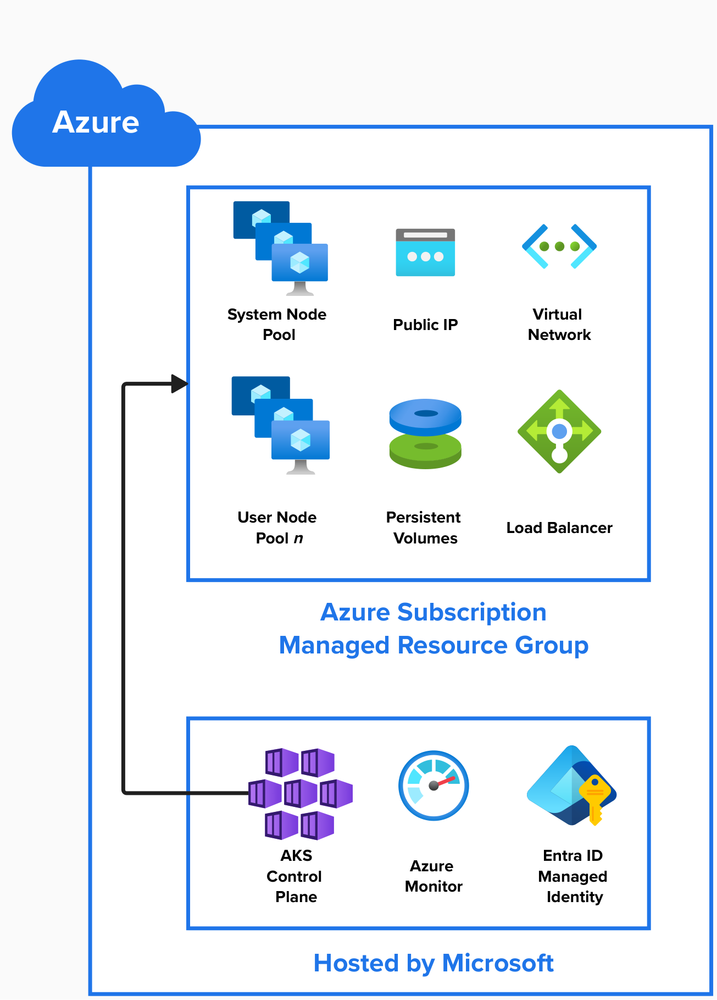
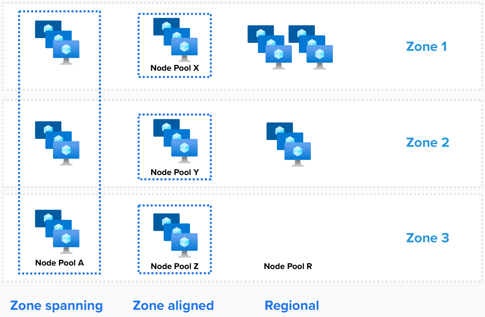

# Availability zones in Azure Kubernetes Service (AKS)
[Availability zones](/azure/reliability/availability-zones-overview) help protect your applications and data from datacenter failures. Zones are unique physical locations within an Azure region. Each zone includes one or more datacenters equipped with independent power, cooling, and networking.

Using AKS with availability zones physically distributes resources across different availability zones within a single region, improving reliability.


If a zone becomes unavailable, AKS adjusts resources as required.
This article shows you how to configure AKS resources to use Availability Zones.

## AKS Resources




### [AKS Control Plane](/azure/aks/core-aks-concepts#control-plane)
Microsoft hosts the Kubernetes API server and services such as `scheduler` and `etcd` as a managed service. The **Standard** pricing tier and up uses Availability Zones.

The other resources of your cluster deploy in a managed resource group in your Azure subscription. By default, this resource group is prefixed with *MC_*, for Managed Cluster.

### Node pools
Node pools are created as a Virtual Machine Scale Set in your Azure Subscription. 

When you create an AKS cluster, one [System Node pool](/azure/aks/use-system-pools) is required and created automatically. It hosts critical system pods such as `CoreDNS` and `metrics-server`. More [User Node pools](/azure/aks/create-node-pools) can be added to your AKS cluster to host your applications.

There are three ways node pools can be deployed: Zone spanning, Zone aligned, and Regional.




#### Zone spanning (recommended)
A zone spanning scale set spreads nodes across all selected zones, by specifying these zones with the `--zones` parameter:

```bash
# Create an Resource Group and pick your preferred Azure Region
az group create --name example-rg --region eastus
# Create an AKS Cluster, and create a zone spanning System Nodepool in all three AZs, one node in each AZ
az aks create --resource-group example-rg --name example-cluster --node-count 3 --zones 1, 2, 3
# Add one new zone spanning User Nodepool, two nodes in each
az aks nodepool add --resource-group example-rg --cluster-name example-cluster --name userpool-a  --node-count 6 --zones 1, 2, 3 
```
AKS balances the number of nodes between zones automatically. If a zonal outage or connectivity issue occurs, connectivity to nodes within the affected zone can be compromised, while nodes in other availability zones should be unaffected. You can add capacity to the node pool during a zonal outage, and the node pool adds more nodes to the unaffected zones.

#### Zone aligned
Each node and its disks are zonal, so they're pinned to a specific zone. To create three node pools for a region with three Availability Zones:

```bash
# # Add three new zone aligned User Nodepools, two nodes in each
az aks nodepool add --resource-group example-rg --cluster-name example-cluster --name userpool-x  --node-count 2 --zones 1
az aks nodepool add --resource-group example-rg --cluster-name example-cluster --name userpool-y  --node-count 2 --zones 2
az aks nodepool add --resource-group example-rg --cluster-name example-cluster --name userpool-z  --node-count 2 --zones 3
```

 This configuration is primarily used when you need [lower latency between nodes](/azure/aks/reduce-latency-ppg). It also provides more granular control over scaling operations, or when using the [cluster autoscaler](./cluster-autoscaler-overview.md). 

> [!NOTE]
> * If a single workload is deployed across node pools, we recommend setting `--balance-similar-node-groups`  to `true` to maintain a balanced distribution of nodes across zones for your workloads during scale up operations.

#### Regional (not using Availability Zones)
Regional is used when the zone assignment isn't set in the deployment template (`"zones"=[] or "zones"=null`).

In this configuration, the node pool creates Regional (not-zone pinned) instances and implicitly places instances throughout the region. There's no guarantee for balance or spread across zones, or that instances land in the same availability zone. Disk colocation is guaranteed for Ultra and Premium v2 disks, best effort for Premium v1 disks, and not guaranteed for Standard disks.

In the rare case of a full zonal outage, any or all instances within the node pool can be impacted.

To validate node locations, run the following command:

```bash
kubectl describe nodes | grep -e "Name:" -e "topology.kubernetes.io/zone"
```

```output
NAME                                REGION   ZONE
aks-nodepool1-34917322-vmss000000   eastus   eastus-1
aks-nodepool1-34917322-vmss000001   eastus   eastus-2
aks-nodepool1-34917322-vmss000002   eastus   eastus-3
```

## Deployments

### Pods
Kubernetes is aware of Azure Availability Zones, and balances pods across nodes in different zones. In the event a zone becomes unavailable, Kubernetes moves pods away from impacted nodes automatically.

As documented in [Well-Known Labels, Annotations and Taints][kubectl-well_known_labels], Kubernetes uses the `topology.kubernetes.io/zone` label to automatically distribute pods in a replication controller or service across the different zones available.
To view on which pods nodes are running, run the following command:

```bash
  kubectl describe pod | grep -e "^Name:" -e "^Node:"
```

For smaller deployments, we recommend you modify the 'maxSkew' parameter for a deployment.
Assuming three zones and three replicas, setting this value to one ensures each zone has at least one pod running.

```yaml
kind: Pod
apiVersion: v1
metadata:
  name: myapp
spec:
  replicas: 3
  topologySpreadConstraints:
  - maxSkew: 1
    topologyKey: "topology.kubernetes.io/zone"
    whenUnsatisfiable: DoNotSchedule # or ScheduleAnyway
  containers:
  - name: pause
    image: registry.k8s.io/pause:3.1
```

### Storage and volumes
Kubernetes 1.29 and up by default uses Azure Managed Disks using Zone-Redundant-Storage (ZRS) for persistent volume claims. These disks can be attached across zones and it's the recommended deployment method for production workloads, as it enhances the resilience of your applications and safeguards your data against datacenter failures.

This example creates a 5GB Standard SSD ZRS disk:

```yaml
apiVersion: v1
kind: PersistentVolumeClaim
metadata:
    name: azure-managed-disk
spec:
  accessModes:
  - ReadWriteOnce
  storageClassName: managed-csi
  #storageClassName: managed-csi-premium
  resources:
    requests:
      storage: 5Gi
```

For zone aligned deployments, you can create a new storage class with the `skuname` parameter set to LRS (Locally redundant storage). You can then use the new storage class in your Persistent Volume Claim (PVC). Volumes that use Azure managed LRS disks aren't zone-redundant resources, and attaching across zones isn't supported.

```yaml
kind: StorageClass
apiVersion: storage.k8s.io/v1
metadata:
  name: azuredisk-csi-standard-lrs
provisioner: disk.csi.azure.com
parameters:
  skuname: StandardSSD_LRS
  #skuname: PremiumV2_LRS
```

### Load Balancers
Kubernetes deploys an Azure Standard Load Balancer by default, which balances inbound traffic across all zones in a region. If a node becomes unavailable, the load balancer reroutes traffic to healthy nodes.

```yaml
apiVersion: v1
kind: Service
metadata:
  name: example
spec:
  type: LoadBalancer
  selector:
    app: myapp
  ports:
    - port: 80
      targetPort: 8080
```

> [!IMPORTANT]
> On September 30, 2025, Basic Load Balancer will be retired. For more information, see the official announcement. If you're currently using Basic Load Balancer, make sure to [upgrade](/azure/load-balancer/load-balancer-basic-upgrade-guidance) to Standard Load Balancer before the retirement date.

## Limitations

The following limitations apply when using Availability Zones:

* See [Quotas, Virtual Machine size restrictions, and region availability in AKS][quotas-skus-regions].
* The number of Availability Zones used **cannot be changed** after the node pool is created.
* Most regions support Availability Zones. A list can be found [here](/azure/reliability/availability-zones-region-support).

## Next steps

* Learn about [System Node pool](/azure/aks/use-system-pools) 
* Learn about [User Node pools](/azure/aks/create-node-pools)
* Learn about [Load Balancers](/azure/aks/load-balancer-standard)
* [Best practices for business continuity and disaster recovery in AKS](best-practices-bc-dr)