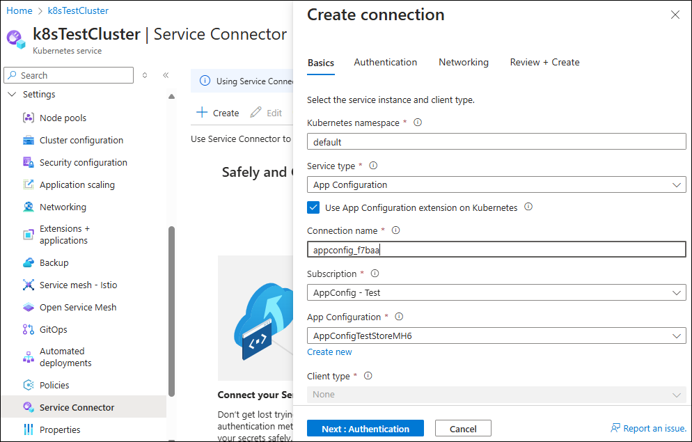

# Build ConfigMap by Azure App Configuration extension to configure workload in Azure Kubernetes Service (AKS)

Typically, ConfigMap is used to configure workloads in AKS. [Azure App Configuration](/azure/azure-app-configuration/overview) provides a service to centrally manage application settings and feature flags. Following this tutorial, you will learn how to source the configuration data from Azure App Configuration into a ConfigMap and use it to configure your workload in AKS.

## Prerequisites

* An Azure Kubernetes Service (AKS) cluster. [Create an AKS cluster](/azure/aks/tutorial-kubernetes-deploy-cluster#create-a-kubernetes-cluster).
* A running workload in Azure Kubernetes Service (AKS) cluster. If you don't have one, you can [create a demo application running in AKS](/azure/azure-app-configuration/quickstart-azure-kubernetes-service#create-an-application-running-in-aks).

## Create a service connection to App Configuration store

Create a service connection between your AKS cluster and your App Configuration store using Microsoft Entra Workload Identity.

1. In the [Azure portal](https://portal.azure.com), navigate to your AKS cluster resource.

1. Select **Settings** > **Service Connector (Preview)** > **Create**.

1. On the Basics tab, configure the following settings:
   
   - **Kubernetes namespace**: Specify the namespace you'd like to create ConfigMap or Secret to.
   - **Service type**: Select `App Configuration`.
   - Check the checkbox **Enable App Configuration Extension on Kubernetes**: This will enable you use the [Azure App Configuration AKS extension](./azure-app-configuration.md) for this connection, if the Azure App Configuration AKS extension is not installed yet, it will be installed automatically.
   - **Connection name**: Use the connection name provided by Service Connector or enter your own connection name.
   - **Subscription**: Select the subscription of your App Configuration store.
   - **App Configuration**: Select your App Configuration store. If you don't have one, you can create a new one by clicking **Create new**.

    

1. Select **Next: Authentication**. On the **Authentication** tab, select the authentication method you would like to use to access the App Configuration store.

1. Select **Next: Networking** > **Next: Review + create**

2. Wait for the validation to pass, select **Create**.

3. Wait for the service connection to be created.

> [!NOTE]
> The Azure App Configuration AKS extension is an independent component and does not have to rely on **Service Connection** to use it. You can refer to the [Azure App Configuration AKS extension reference](./azure-app-configuration.md) to learn more about the extension.
>

## Build ConfigMap and use it to configure workload

Now that you created a connection between your AKS cluster and the App Configuration store, you need to use the connection to create a ConfigMap with the configuration data from the App Configuration store.

1. In the [Azure portal](https://portal.azure.com), navigate to your AKS cluster resource and select **Service Connector (Preview)**.

1. Select the newly created connection, and then select **Yaml snippet**.

1. On the **AzureAppConfigurationProvider** tab，configure the following settings:
   
   - **Using configuration as**: Select how you want to use the configuration data in your workload. You can use it as a mounted file or environment variables.
   - If you select **Mounted file**, you need to provide the file type and file name.
   - **Selector**: Select the configuration key-value pairs to be used from the App Configuration store.

1. An **AzureAppConfigurationProvider** YAML snippet is auto generated based on your above input. Click **Apply** to apply it to your AKS cluster. It will create a ConfigMap in your AKS cluster with the selected configuration data from the App Configuration store.

    

1. Click **Next**，on the **Workload** tab, configure the following settings:
   
   - If you select **Mounted file**, you need to provide the file mount path.
   - **Kubernetes Workload**: select an existing Kubernetes workload. The snippet includes highlighted sections showing the newly generated configMap will be used as mounted file on your selected workload. Select **Apply** to update the workload.

> [!TIP]
> This tutorial just show you a basic example of how to use Azure App Configuration AKS extension to configure your workload in AKS. Refer to the [Azure App Configuration Kubernetes Provider reference](/azure/azure-app-configuration/reference-kubernetes-provider) to learn more about all supported features.
>

## Next Steps

* Learn more about [extra settings and preferences](./azure-app-configuration-settings.md) you can set on the Azure App Configuration extension.
* Learn all the supported features of [Azure App Configuration extension](/azure/azure-app-configuration/reference-kubernetes-provider).